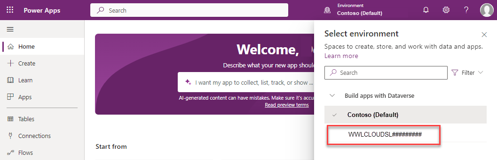

---
lab:
  title: 'ラーニング パス 1 - ラボ 1.1: 顧客エンゲージメント アプリを使用する'
  learning path: Explore the core capabilities of Microsoft Dynamics 365 customer engagement apps
  module: Describe the foundations of Dynamics 365 customer engagement apps
---

ラーニング パス 1 - モジュール 1: Dynamics 365 顧客エンゲージメント アプリの基盤ついて説明する
========================

## 実践ラボ 1.1 - 顧客エンゲージメント アプリの使用 

## 目標

この演習では、さまざまな Dynamics 365 顧客エンゲージメント アプリケーションにアクセスしてナビゲートする方法を理解します。 

## ラボのセットアップ

  - **推定時間**:10 分

## Instructions

1. Web ブラウザーで、[https://make.powerapps.com](https://make.powerapps.com/) に移動します。 

2. 講師から提供された資格情報を使用してログインします。 最初にログインすると、**Contoso (既定)** 環境に移動します。 通常、既定の環境では作業を行いません。 トレーニング専用の環境に変更する予定です。 

3.  上部にある環境セレクターを使用して、環境 **Contoso (既定値)** を選択します。 

4. 表示されるメニューから、講師が示す専用のトレーニング環境を選択します。 (ホストされているトレーニング テナントの場合、環境は **WWLCLOUD** などから始まる可能性があります)。

5. 正しい環境で作業したら、左側のナビゲーションを使用して、 **[アプリ]** を選択します。 

6. **[アプリ]** の一覧で、**営業ハブ** アプリケーションを開きます。 アプリ内にいるときは、何をしようとしているかに基づいて、さまざまな領域で作業できます。 たとえば、営業ハブ アプリケーションには、操作可能なさまざまな管理設定が含まれています。

7. 画面の左下で、左側のナビゲーション ウィンドウまたは **[サイト マップ]** の一番下で、 **[販売]** というテキストを選択し、表示される一覧から **[アプリの設定]** を選択します。 **[アプリの設定]** では、管理設定の確認および変更を行うことができます。 左側のナビゲーション項目がどのように変化したかに注目してください。

8. **[変更の領域]** セレクターをもう一度選択し、 **[アプリの設定]** から **[販売]** に戻します。

9. 営業アプリから Customer Service ワークスペースなどの別のアプリに切り替える場合は、画面左上の [Dynamic 365] というテキストの横にある **[営業ハブ]** を選びます。

10.  **[アプリ]** セレクター ポップアップが表示されたら、 **[顧客サービス ハブ]** を選択します。 **[顧客サービス ハブ]** アプリケーションが表示されます。 **[顧客サービス ハブ]** には、 **[変更の領域]** メニューで使用できるさまざまな領域が用意されていることに注意してください。

11. **[販売ハブ]** アプリに戻すには、上部にある **[顧客サービス ハブ]** テキストを選択して、 **[アプリ]** セレクターポップアップを開きます。 **[販売ハブ]** を選択します。

別の方法として、Microsoft 365 ポータルからビジネス アプリケーションにアクセスできます。

12. Web ブラウザーで、[https://www.microsoft365.com/apps](https://www.microsoft365.com/apps) に移動します。 アクセスできるすべてのアプリケーションが表示されます。

13. **[ビジネス アプリ]** タブを選択して、Dynamics 365 ビジネス アプリケーションのみを表示するように表示されるアプリケーションを制限します。

14. **Sales Hub** アプリを選択して開きます。

15. アプリ内にいるときは、何をしようとしているかに基づいて、さまざまな領域で作業できます。 たとえば、営業ハブ アプリケーションには、操作可能なさまざまな管理設定が含まれています。

16. 画面の左下で、 **[営業]** というテキストを選び、表示される一覧から **[アプリの設定]** を選びます。 アプリケーションのこの部分では、管理上の変更を加えることができます。

17. エリア セレクターを再度選択し、**[アプリ設定]** から **[営業]** に戻します。

18. 営業アプリから顧客サービス ハブなどの別のアプリに切り替える場合は、画面の左上にある [Dynamic 365] テキストの横にある **[営業ハブ]** テキストを選択します。

19. [アプリ] 画面が表示されたら、**[顧客サービス ハブ]** を選択すると、顧客サービス ハブ アプリケーションが表示されます。

20. 上部にある **[顧客サービス ハブ]** テキストを選択して、**[営業ハブ]** アプリに切り替えます。
